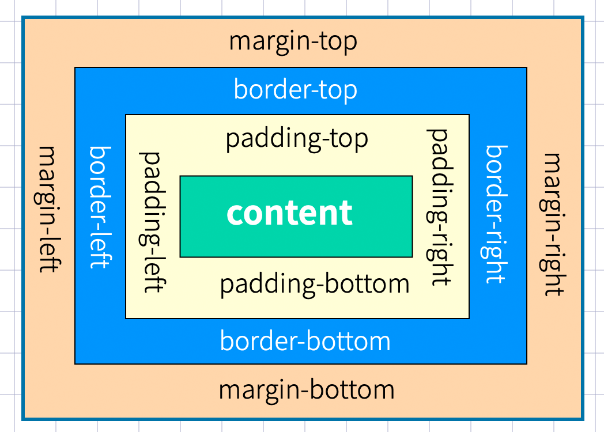
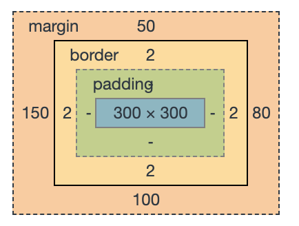

# 盒模型
> 盒模型是指：外边距（margin）+ border（边框） + 内边距（padding）+ content（内容），可以把每一个容器，比如 `div` 都看做是一个盒模型。



<br />

# 外边距
## 声明定义
边距顺序依次为：上、右、下、左。



```css
{
  margin: 50px 80px 100px 150px;
}
```

下例定义上下50px边距，左右 `80px` 边距

```css
{
  margin: 50px 80px;
}
```

下面将边距全部定义为 `100px`

```css
{
  margin: 100px;
}
```

## 居中设置

margin 设置 auto 后，浏览器会自动

```css
article {
  border: solid 1px red;
}

h2 {
  width: 300px;
  margin: 0 auto;
  background-color: #ddd;
}
```

```html
<article>
  <h2>Jett</h2>
</article>
```

## 边距合并
相邻元素的纵向外边距会进行合并

```css
{
  margin-top: 20px;
  margin-bottom: 20px;
}
```

# 内边距
内边距使用 `padding` 进行定义，使用语法与 `margin` 相似。

```css
{
  padding: 10px 30px;
  border: solid 1px #ddd;
  border-radius: 5px;
}
```

# BOX-SIZING
宽度与高度包括内边距与边框。

```css
{
  padding: 50px;
  border: solid 10px #ddd;
  height: 200px;
  width: 200px;
  /* 标准盒模型(浏览器默认) */
  box-sizing: content-box;
  /* 怪异盒模型 */
  box-sizing: border-box;
}
```

# 边框设计

## 边框样式

| 类型   | 描述                                                  |
| ------ | ----------------------------------------------------- |
| none   | 定义无边框                                            |
| dotted | 定义点状边框。在大多数浏览器中呈现为实线              |
| dashed | 定义虚线。在大多数浏览器中呈现为实线                  |
| solid  | 定义实线。                                            |
| double | 定义双线。双线的宽度等于 border-width 的值。          |
| groove | 定义 3D 凹槽边框。其效果取决于 border-color 的值。    |
| ridge  | 定义 3D 垄状边框。其效果取决于 border-color 的值。    |
| inset  | 定义 3D inset 边框。其效果取决于 border-color 的值。  |
| outset | 定义 3D outset 边框。其效果取决于 border-color 的值。 |

一次定义四个边
```css
h2 {
	border-style: double;
}
```

> 样式顺序为上、右、下、左，可以分别进行定义

```css
h2 {
	border-style: outset solid dotted double;
	border-width: 8px;
}
```

| 规则                | 说明 |
| ------------------- | ---- |
| border-top-style    | 顶边 |
| border-right-style  | 右边 |
| border-bottom-style | 下边 |
| border-left-style   | 左边 |
| border-style        | 四边 |

<br />

## 边框宽度

| 规则                | 说明 |
| ------------------- | ---- |
| border-top-width    | 顶边 |
| border-right-width  | 右边 |
| border-bottom-width | 下边 |
| border-left-width   | 左边 |
| border-width        | 四边 |

<br />

## 边框颜色

| 规则                | 说明 |
| ------------------- | ---- |
| border-top-color    | 顶边 |
| border-right-color  | 右边 |
| border-bottom-color | 下边 |
| border-left-color   | 左边 |
| border-color        | 四边 |

<br />

## 简写规则

| 规则          | 说明 |
| ------------- | ---- |
| border-top    | 顶边 |
| border-right  | 右边 |
| border-bottom | 下边 |
| border-left   | 左边 |
| border        | 四边 |

设置底部边框

```css
{
  border-bottom: 5px solid red;
}
```

## 圆角边框

使用 `border-radius` 规则设置圆角，可以使用 `px` | `%` 等单位。也支持四个边分别设置。

| 选项                       | 说明 |
| -------------------------- | ---- |
| border-top-left-radius     | 上左 |
| border-top-right-radius    | 上右 |
| border-bottom-left-radius  | 下左 |
| border-bottom-right-radius | 下右 |

```css
h2 {
	border-radius: 10px;
	border: 2px solid red;
}
```

# DISPLAY

## 控制显示隐藏
使用 `display` 控制元素的显示机制。

| 选项         | 说明                        |
| ------------ | --------------------------- |
| none         | 隐藏元素                    |
| block        | 显示为块元素                |
| inline       | 显示为行元素，不能设置宽/高 |
| inline-block | 行级块元素，允许设置宽/高   |


## 行转块元素
```css 
a {
  display: block;
}
```

## 块转为行元素
```css 
div {
  display: inline;
}
```

# VISIBILITY
控制元素的显示隐藏，在隐藏后空间位也保留。

```css
{
  visibility: hidden;
}
```

# 溢出控制

| 选项   | 说明                   |
| ------ | ---------------------- |
| hidden | 溢出内容隐藏           |
| scroll | 显示滚动条             |
| auto   | 根据内容自动处理滚动条 |

## 溢出试隐藏
```css
div {
  width: 400px;
  height: 100px;
  border: solid 2px #ddd;
  padding: 20px;
  overflow: hidden;
}
```

## 溢出产生滚动条
```css
div {
  width: 400px;
  height: 100px;
  border: solid 2px #ddd;
  padding: 20px;
  overflow: scroll;
}
```

## 文本溢出

单行文本溢出

```css
div {
  width: 200px;
  border: solid 1px #ddd;
  white-space: nowrap;
  overflow: hidden;
  text-overflow: ellipsis;
}
```

多行文本溢出
```css
div {
  width: 200px;
  border:solid 1px #ddd;
  overflow: hidden;
  display: -webkit-box;
  -webkit-box-orient: vertical;
  -webkit-line-clamp: 2;
}
```

# 尺寸定义

可以使用多种方式为元素设置宽、高尺寸。

| 选项           | 说明             |
| -------------- | ---------------- |
| width          | 宽度             |
| height         | 高度             |
| min-width      | 最小宽度         |
| min-height     | 最小高度         |
| max-width      | 最大宽度         |
| max-height     | 最大高度         |
| fill-available | 撑满可用的空间   |
| fit-content    | 根据内容适应尺寸 |

## fill-available

```css
.fill-available {
  background: #9b59b6;
  height: 100px;
  padding: 20px;
  box-sizing: border-box;
}

.fill-available span {
  background: #e67e22;
  display: inline-block;
  width: -webkit-fill-available;
  height: -webkit-fill-available;
}
```